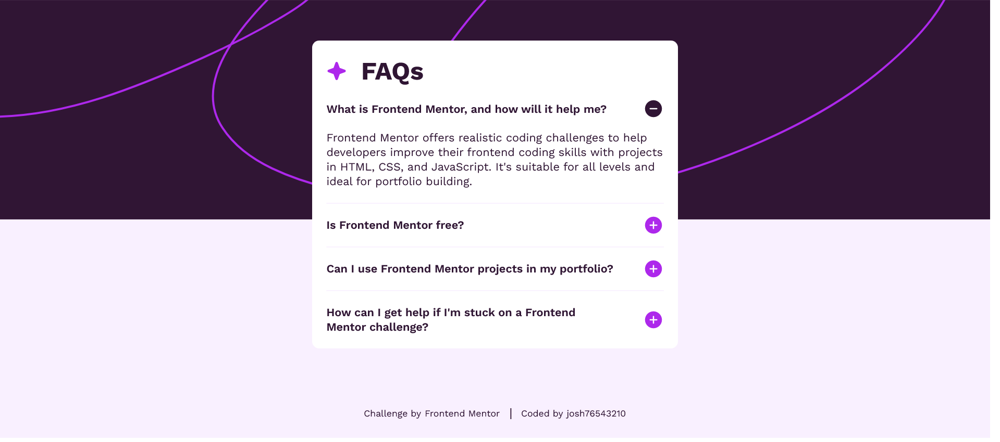

# Frontend Mentor - FAQ accordion solution

This is a solution to the [FAQ accordion challenge on Frontend Mentor](https://www.frontendmentor.io/challenges/faq-accordion-wyfFdeBwBz). Frontend Mentor challenges help you improve your coding skills by building realistic projects.

## Table of contents

- [Overview](#overview)
  - [The challenge](#the-challenge)
  - [Screenshot](#screenshot)
  - [Links](#links)
- [My process](#my-process)
  - [Built with](#built-with)
  - [What I learned](#what-i-learned)
- [Author](#author)

## Overview

### The challenge

Users should be able to:

- Hide/Show the answer to a question when the question is clicked
- Navigate the questions and hide/show answers using keyboard navigation alone
- View the optimal layout for the interface depending on their device's screen size
- See hover and focus states for all interactive elements on the page

### Screenshot



### Links

- Solution URL: [Add solution URL here]()
- Live Site URL: [Add live site URL here]()

## My process

### Built with

- HTML
- CSS
- TypeScript
- Vite

### What I learned

Using TypeScript for the first time inside a project:

```json
"devDependencies": {
    "typescript": "^5.2.2",
    "vite": "^5.0.8"
  }
```

## Author

- GitHub - [@josh76543210](https://github.com/josh76543210)
- Frontend Mentor - [@josh76543210](https://www.frontendmentor.io/profile/josh76543210)
- Twitter - [@josh76543210](https://www.twitter.com/josh76543210)
